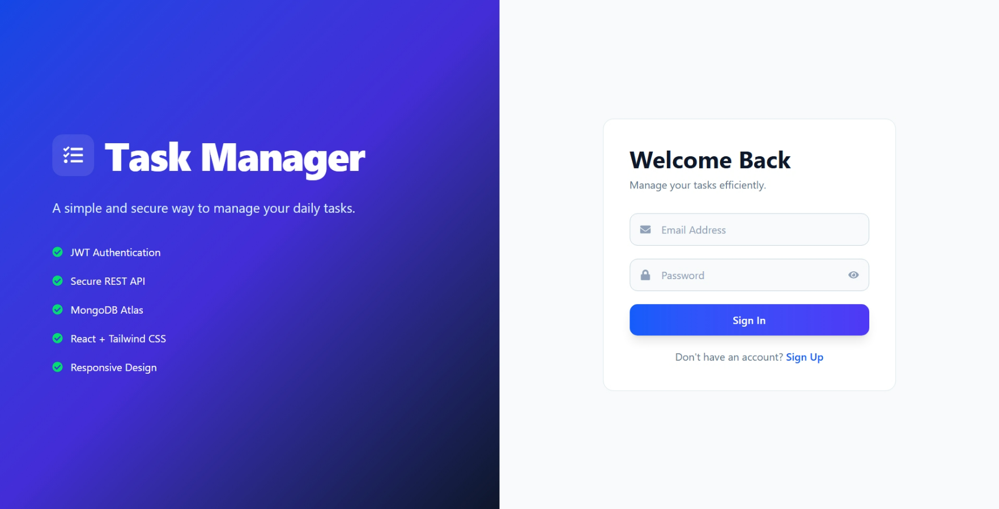
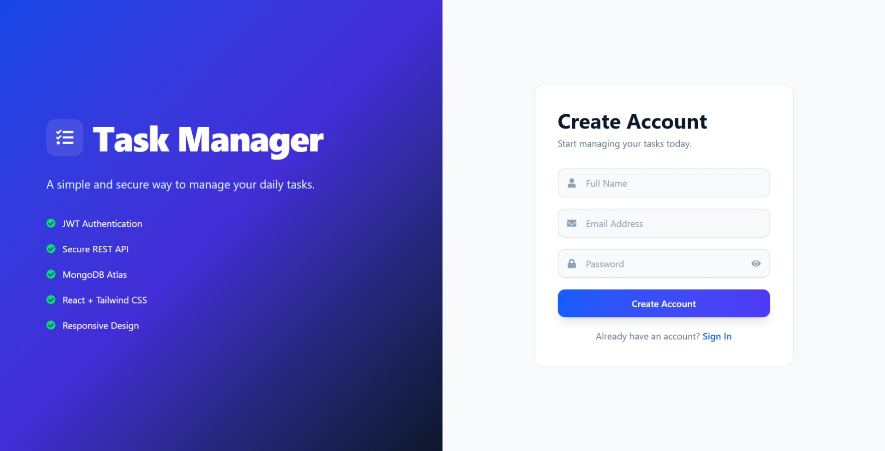
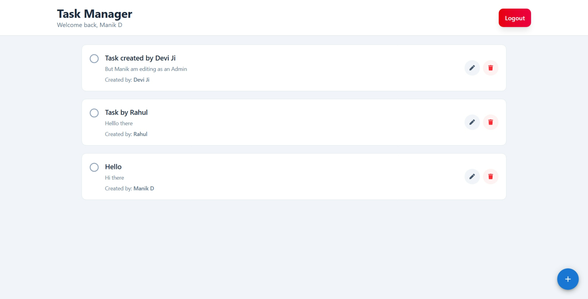
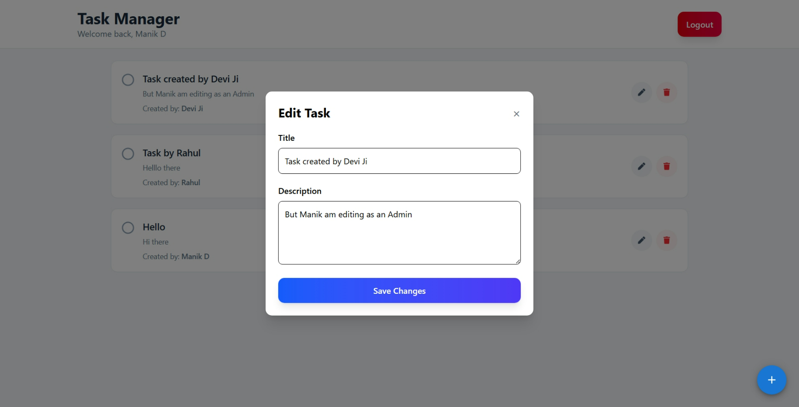
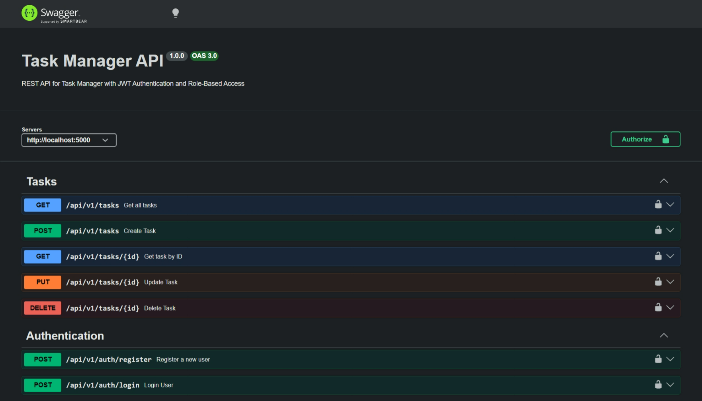

# 🚀 Task Manager – Full Stack REST API with JWT Authentication & Role-Based Access


# 🚀 Task Manager – Backend Developer Internship Assignment

A secure, scalable full-stack Task Manager application demonstrating REST API development, JWT authentication, role-based authorization, and modern frontend integration.

> **Assignment Focus:** Secure backend architecture, scalable REST APIs, and clean frontend integration.

A production-ready full-stack Task Manager application developed as part of the **Backend Developer Internship Assignment**.

The application demonstrates secure authentication, role-based authorization, scalable REST API design, robust validation, global error handling, Swagger documentation, and a responsive React frontend.

---

# 🌐 Live Demo

### Frontend
https://task-manager-assignment-beta-three.vercel.app/

### Backend API
https://task-manager-assignment-1-d0h2.onrender.com

### Swagger Documentation
https://task-manager-assignment-1-d0h2.onrender.com/api-docs

### GitHub Repository
https://github.com/developermanikdas/task-manager-assignment

---

# 📌 Assignment Requirements Covered

| Requirement | Status |
|-------------|--------|
| User Registration | ✅ |
| User Login | ✅ |
| Password Hashing | ✅ |
| JWT Authentication | ✅ |
| Role-Based Access | ✅ |
| CRUD APIs | ✅ |
| API Versioning | ✅ |
| Validation | ✅ |
| Global Error Handling | ✅ |
| Swagger Documentation | ✅ |
| MongoDB Database | ✅ |
| React Frontend | ✅ |
| Protected Dashboard | ✅ |
| Error Messages | ✅ |
| Success Notifications | ✅ |
| Deployment | ✅ |

---

# ✨ Features

## 🔐 Authentication

- User Registration
- User Login
- JWT Authentication
- Password Hashing using bcrypt
- Protected Routes
- Persistent Login using Context API & Local Storage

---

## 👤 Role-Based Authorization

### User

- Create Tasks
- View Own Tasks
- Update Own Tasks
- Delete Own Tasks

### Admin

- View All Users' Tasks
- Update Any Task
- Delete Any Task
- View Task Creator

---

## ✅ Task Management

- Create Task
- View Task
- Update Task
- Delete Task
- Mark Complete / Pending
- Optimistic UI Updates
- Loading States

---

## 🎨 Frontend Features

- Responsive Design
- Modern UI
- Protected Dashboard
- Floating Action Button
- Material UI Snackbar Notifications
- Loading Indicators
- Empty State UI
- Context API Authentication

---

## 🛡 Security Features

- Password Hashing (bcrypt)
- JWT Authentication
- Protected Routes
- Role-Based Authorization
- Joi Validation
- MongoDB ObjectId Validation
- Global Error Handling
- Centralized Error Responses

---

## 📖 API Documentation

- Swagger UI
- RESTful API Design
- Standard HTTP Status Codes
- Versioned API (`/api/v1`)

---

# 🏗 Project Structure

```text
Task-Manager/

├── backend
│   ├── src
│   │   ├── config
│   │   ├── controllers
│   │   ├── docs
│   │   ├── middleware
│   │   ├── models
│   │   ├── routes
│   │   ├── utils
│   │   ├── validators
│   │   ├── app.js
│   │   └── server.js
│   │
│   ├── package.json
│   └── .env
│
├── frontend
│   ├── src
│   │   ├── components
│   │   ├── context
│   │   ├── pages
│   │   ├── services
│   │   ├── utils
│   │   └── App.jsx
│   │
│   └── package.json
│
└── README.md
```

---

# 🛠 Tech Stack

## Backend

- Node.js
- Express.js
- MongoDB Atlas
- Mongoose
- JWT
- bcrypt
- Joi
- Swagger
- Helmet
- Morgan
- CORS

---

## Frontend

- React
- Vite
- React Router DOM
- Axios
- Tailwind CSS
- Material UI
- Context API

---

## Deployment

- Vercel
- Render
- MongoDB Atlas

---

# ⚙ Installation

## Clone Repository

```bash
git clone https://github.com/developermanikdas/task-manager-assignment.git
```

---

## Backend

```bash
cd backend

npm install
```

Create `.env`

```env
PORT=5000

MONGO_URI=

JWT_SECRET=

JWT_EXPIRES_IN=7d
```

Run

```bash
npm run dev
```

---

## Frontend

```bash
cd frontend

npm install

npm run dev
```

---

# 🌐 API Endpoints

## Authentication

| Method | Endpoint | Description |
|---------|----------|-------------|
| POST | /api/v1/auth/register | Register User |
| POST | /api/v1/auth/login | Login User |

---

## Tasks

| Method | Endpoint | Description |
|---------|----------|-------------|
| GET | /api/v1/tasks | Get Tasks |
| GET | /api/v1/tasks/:id | Get Task |
| POST | /api/v1/tasks | Create Task |
| PUT | /api/v1/tasks/:id | Update Task |
| DELETE | /api/v1/tasks/:id | Delete Task |

---

# 🔑 Authentication

All protected routes require:

```text
Authorization: Bearer <JWT_TOKEN>
```

---

# 📖 Swagger

Local

```
http://localhost:5000/api-docs
```

Production

```
https://YOUR-RENDER-URL.onrender.com/api-docs
```

---

# 🧪 Tested Scenarios

## User

- Register
- Login
- Create Task
- Update Own Task
- Delete Own Task
- View Own Tasks

---

## Admin

- View All Tasks
- Update Any User's Task
- Delete Any User's Task
- View Task Creator

---

# 📸 Screenshots







---

# 📈 Scalability Considerations

The project follows a modular MVC architecture that allows new features to be added with minimal changes.

Future production improvements include:

- Redis Caching
- Docker
- CI/CD Pipeline
- Load Balancing
- Horizontal Scaling
- API Rate Limiting
- Centralized Logging
- Refresh Token Authentication
- Search & Pagination
- Microservice Architecture

---

# 🚀 Future Enhancements

- Email Verification
- Forgot Password
- Refresh Tokens
- Search
- Filtering
- Pagination
- Categories
- File Attachments
- Notifications
- Dark Mode

---

# 👨‍💻 Author

## Manik Das

Bachelor of Computer Applications (BCA)

Backend Developer | MERN Stack Developer

GitHub

https://github.com/developermanikdas

LinkedIn

https://linkedin.com/in/YOUR-LINKEDIN

---

# 📄 License

This project was developed as part of a Backend Developer Internship assignment and is intended for educational and evaluation purposes.